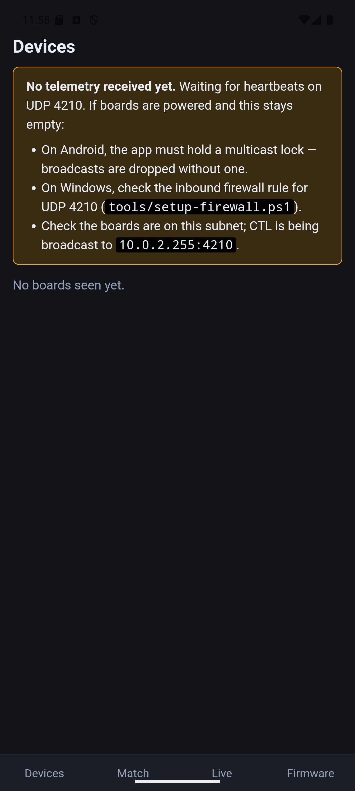
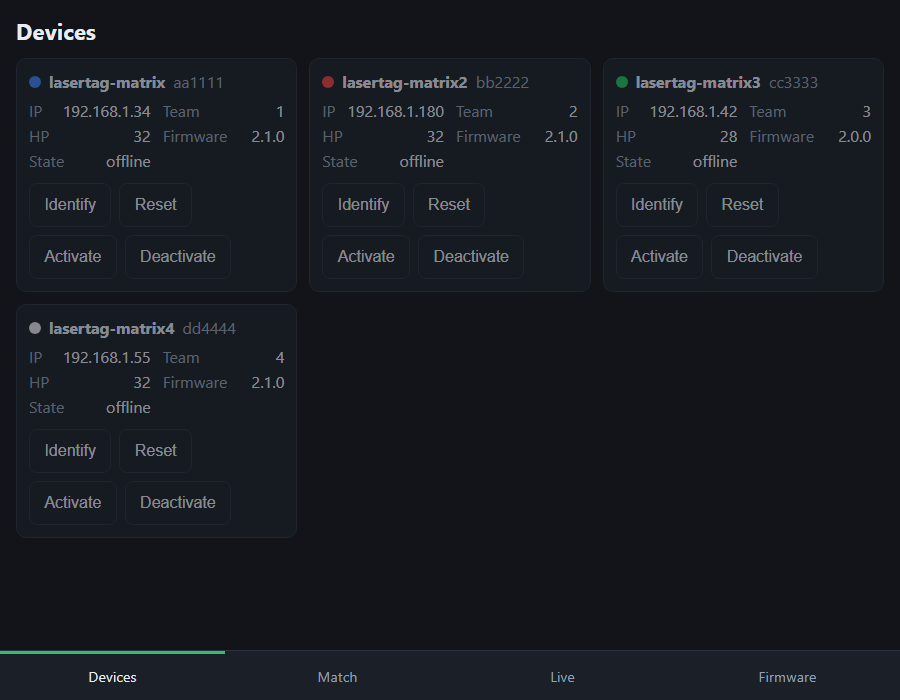

# Lolin32 OLED Laser Tag

Reverse-engineering, decoding, and transmitting **Vatos** infrared laser-tag
signals across two ESP32 boards:

- **Lolin32 OLED** (ESP32 + 128×32 SSD1306) — IR monitor / decoder / transmitter
  and the C# trainer feeder. Reads NEC remotes and Vatos shots to the OLED, and
  fires Vatos shots via an IR LED.
- **ESP32-S3-Matrix** (ESP32-S3 + 8×8 WS2812) — a wearable **target**: idles in
  a rainbow, tracks its own health, flashes the firing team's colour and goes
  briefly dark when hit, and holds dark when its health reaches zero.

Both boards support **wireless OTA updates and UDP telemetry** (see
[Wireless](#wireless)). A **network control plane** (REST + UDP) configures and
controls devices, with a **.NET client library** on the host side (see
[Control plane](#control-plane-v2)). Shared logic lives in libraries:
`lib/Vatos` (decode/encode), `lib/IrFramer` (IR edge framing), `lib/TagNet`
(WiFi + OTA + HTTP + UDP), and `lib/ControlProto` (the protocol-agnostic wire
codec for the control plane).

> The Vatos IR protocol is not documented publicly; the protocol description in
> `docs/gun-protocol.md` was reverse-engineered from scratch in this project.

---

## Table of contents

- [What it does](#what-it-does)
- [Hardware](#hardware)
- [Build, flash, monitor](#build-flash-monitor)
- [Wireless](#wireless)
- [Control plane (V2)](#control-plane-v2)
- [How it works](#how-it-works)
- [The Vatos protocol (reverse-engineered)](#the-vatos-protocol-reverse-engineered)
- [The Vatos library](#the-vatos-library)
- [The C# signal trainer](#the-c-signal-trainer)
- [The journey (how we got here)](#the-journey-how-we-got-here)
- [Repository layout](#repository-layout)
- [Future work](#future-work)

---

## What it does

- **Receives** 38 kHz IR and decodes it live:
  - **NEC** remotes → `address:command` (e.g. `0707:04`)
  - **Vatos** laser-tag shots → `team` + `damage` (e.g. `Blue 2`)
- **Displays** the decode on the on-board OLED, with a blink LED on every hit.
- **Transmits** valid Vatos shots via an IR LED (38 kHz carrier, correct frame
  + checksum), triggered by the BOOT button or any byte over serial.
- **Trains/recognises** signals from a PC via the C# `IrSignalTrainer` app,
  matching NEC codes exactly and other protocols by full-frame fingerprint.
- **Networks** the target: broadcasts discovery heartbeats and hit/state
  telemetry over UDP, serves a JSON REST API for config/control, accepts
  low-latency UDP control broadcasts, and is driven from a host-side **.NET
  client library** (see [Control plane](#control-plane-v2)).

---

## Hardware

### Carrier PCB (ESP32-S3-Matrix target)

A custom 100×80 mm 2-layer carrier board for the S3 target lives in
[`hardware/lasertag-carrier/`](hardware/lasertag-carrier/): socketed
ESP32-S3-Matrix, MAX98357A audio, microSD, IR RX + transistor IR-TX driver,
WS2812 strip output, OLED header, GP2 role selector, power switch and M3
mounting holes.


- **How to build/assemble it** (stage-by-stage, core vs optional blocks,
  jumper settings, bring-up):
  [`instructions/BUILD_LASERTAG_CARRIER_ESP32_MATRIX.md`](instructions/BUILD_LASERTAG_CARRIER_ESP32_MATRIX.md)
- **How it was made** (code → perf-board → Gerbers, tools/tips/gotchas):
  [`PCB_FROM_PLATFORMIO.md`](PCB_FROM_PLATFORMIO.md)
- **Fab package** (PCBWay-ready Gerber zip):
  [`hardware/lasertag-carrier/fab/lasertag-carrier-rev1-gerbers.zip`](hardware/lasertag-carrier/fab/lasertag-carrier-rev1-gerbers.zip),
  also attached to the
  [`pcb-carrier-rev1` release](../../releases/tag/pcb-carrier-rev1)
- **BOM**: [`hardware/lasertag-carrier/bom.csv`](hardware/lasertag-carrier/bom.csv);
  circuit spec: `.docs/pcb-blocks.md`
- **Ordering from PCBWay?** New users can use this referral link for **$5 off
  their first order**: <https://pcbway.com/g/2F9n3B>

### Lolin32 OLED (monitor / decoder / transmitter)

| Function | Pin | Notes |
| -------- | --- | ----- |
| OLED I²C | SDA = GPIO5, SCL = GPIO4 | SSD1306, **128×32**, address `0x3C` |
| IR receiver (VS1838B) | OUT = GPIO25 | demodulating; idles HIGH, pulses LOW |
| Activity LED | GPIO26 | blinks ~80 ms on each received frame |
| IR transmit LED | GPIO13 | 38 kHz carrier via the LEDC peripheral |
| Test-shot trigger | GPIO0 (BOOT) **or** serial | any serial line also fires a shot |

### ESP32-S3-Matrix (target)

| Function | Pin | Notes |
| -------- | --- | ----- |
| 8×8 WS2812 matrix | GPIO14 | on-board, 64 LEDs (NeoPixel) |
| IR receiver (VS1838B) | OUT = GPIO1 | GPIO10–14 are taken by the IMU/matrix |
| Activity LED | GPIO7 | blinks on each received frame |
| (reserved) | GPIO10–13 | on-board QMI8658 IMU |

Behaviour: rainbow when idle → on a Vatos hit, subtract the shot's damage from
its health (**max health 32**), flash the firing team's colour (Blue/Red/Green/White)
4×, then go dark for a brief configurable "stunned" interval (default ~1–5 s;
tune via the control plane) → resume rainbow, keeping accumulated damage. The
**4 central columns** of the 8×8 matrix form a **health bar**: they deplete
top-down as health drops (outer 4 columns stay rainbow). At **0 health** it
holds dark ("dead") until a respawn / reset. The device is **authoritative for
its own health** and emits `EVT hit` / `EVT state` telemetry as it changes (see
[Control plane](#control-plane-v2)). Matrix current is capped to 500 mA
(`setMaxPowerInVoltsAndMilliamps`) for USB safety.

Notes:

- The on-board OLED on this unit is a **128×32** SSD1306 (not the 128×64 the
  Lolin32 normally ships with). Driving it as 128×64 renders garbled,
  interlaced text — the `src/display_test.cpp` diagnostic cycles candidate
  driver/geometry configs to identify the right one.
- The OLED is **not** on the ESP32 default I²C pins, so `Wire.begin(5, 4)` is
  required.
- The receiver/transmit/indicator LEDs in this build are driven **without series
  resistors** at the ESP32's minimum drive strength (`GPIO_DRIVE_CAP_0`, ~5 mA)
  to protect the pins. This is fine for bench/loopback testing but limits IR
  transmit range — a transistor driver + resistor is needed for real range.

---

## Build, flash, monitor

[PlatformIO](https://platformio.org/) project (Arduino framework; boards
`lolin32` and `esp32-s3-devkitc-1`, plus a `native` env for unit tests).

```sh
pio run -e lolin32                                   # build
pio run -e lolin32 -t upload --upload-port COM14     # flash
pio device monitor -p COM14 -b 115200                # serial monitor
```

Environments:

- `lolin32` — Lolin32 firmware (`src/main.cpp`).
- `lolin32_displaytest` — the OLED config finder (`src/display_test.cpp`).
- `esp32-s3-matrix` — Matrix target firmware (`src/matrix_main.cpp`).
- `native` — host-compiled unit tests for `lib/ControlProto` (no board).
- `*-ota` — wireless-upload variants (see [Wireless](#wireless)).

```sh
pio run -e esp32-s3-matrix -t upload --upload-port COM7   # flash the Matrix
pio test -e native                                        # run ControlProto unit tests
```

### Flashing workaround (Lolin32)

This particular board has **no BOOT/EN buttons** and its USB auto-reset into the
bootloader is unreliable, so uploads may fail with
`Wrong boot mode detected (0x17)`. To flash:

1. Jumper **GPIO0 → GND**.
2. Run the upload — the chip now enters download mode and flashes.
3. **Remove the GPIO0–GND jumper** and reset (re-plug USB) so it boots normally.

If the board disappears from Windows entirely, unplug/replug the USB to
re-enumerate the CP210x serial port.

---

## Wireless

Both firmware targets bring up WiFi, ArduinoOTA, and UDP telemetry via the
shared `lib/TagNet` library.

### Set WiFi credentials (over serial)

Credentials are stored in NVS, set with serial commands (no rebuild):

```powershell
./tools/set-wifi.ps1 -Port COM14 -Ssid "MyNetwork" -Password "s3cret"
```

or manually in a serial monitor: `ssid <name>`, `pass <pw>`, `wifi-save`
(also `wifi-status`, `wifi-clear`). The board prints its IP once connected.

### Board-config overrides (cfg command)

A whitelisted subset of board-profile fields can be overridden at runtime
without a rebuild:

```
cfg <key> <value>
```

Examples: `cfg matrixOrder 1`, `cfg matrixPin 27`, `cfg activityLedPin 26`.
Changes are saved to NVS and applied on the next reboot.

### OTA updates

After one USB flash + WiFi provisioning, update over the air — no cable, no
GPIO0 jumper.

**For the S3 fleet, prefer the host's `ota` command** (see
[Game manager](#game-manager-host)): every board now runs 2.1.0, which serves
`POST /api/update`, so `ota all` flashes the whole fleet over HTTP with no
Python and no per-board IP chasing. The espota route below is now only needed
to **bootstrap a board running pre-2.1.0 firmware** (it has no `/api/update`),
and for the Lolin32.

```sh
pio run -e lolin32-ota -t upload          # -> lasertag-lolin32 (IP in platformio.ini)
pio run -e esp32-s3-matrix-ota -t upload  # -> lasertag-matrix  (IP in platformio.ini)
```

> ⚠ `ota all` sends **one binary to every online outdated board** and cannot
> tell an ESP32 from an ESP32-S3 (heartbeats carry no chip field). With the
> **Lolin32 (ESP32)** on the network alongside the S3 fleet, target it
> explicitly with `ota <id>` rather than `all`.

Both `*-ota` envs target the boards' **IP addresses** in `platformio.ini`.
mDNS (`lasertag-*.local`) resolves fine for ping/REST on this dev machine, but
espota is unreliable with mDNS names, so OTA sticks to IPs — resolve the
current one with `ping lasertag-matrix.local` (the matrix roams via DHCP) and
update `upload_port` if it changed, or set a DHCP reservation. OTA can take
several minutes over a weak link (low RSSI), but is reliable.

### Telemetry monitoring

Devices broadcast discovery heartbeats and hit/state telemetry as UDP lines on
port 4210 (see [Control plane](#control-plane-v2) for the grammar). The
`tools/TagMonitor` console app prints them raw:

```sh
dotnet run --project tools/TagMonitor
# lasertag-matrix HB id=752b38 ip=192.168.1.34 fw=2.1.0 team=2 mode=idle hp=32 online=1
# lasertag-matrix EVT hit victim=752b38 shooterTeam=2 dmg=2 proto=vatos hp=30 ts=12345
```

> `mode=` in a heartbeat is the board's **role** (`idle`/`target`/`scoreboard`),
> **not** the match phase — a board reads `mode=idle` throughout a running
> match. There is no per-board match-phase readback; the host is authoritative.

**Discovering boards:** listen to the heartbeat roster (TagMonitor, the host's
`devices`, or either manager) and give it **~30 s**. Don't port-scan the subnet
— it misses boards that answer slowly, and every board roams on DHCP, so any IP
written down here or in `platformio.ini` may already belong to something else.

> **No telemetry but REST works?** That's a missing inbound firewall rule **or**
> a lossy weak-RSSI link. Rule out the firewall with `tools/setup-firewall.ps1`
> (Windows, self-elevating) / `tools/setup-firewall.sh` (Linux/macOS).

---

## Control plane (V2)

A protocol- and mode-agnostic network layer for configuring, controlling, and
monitoring devices. **REST** (reliable, JSON) handles config/CRUD/status; **UDP**
(fast, fire-and-forget on port 4210) handles discovery, telemetry, and
low-latency broadcast control. Devices decode IR into a generic `TagEvent`
(behind an `IrProtocol` abstraction — Vatos is the first protocol) and teams are
a generic indexed set, so game modes and the host never hard-code Vatos.

The full design and the authoritative wire contract (with golden test vectors)
live in
[`docs/superpowers/specs/`](docs/superpowers/specs/2026-06-15-control-plane-contract.md).

### REST API (served by the device)

| Method | Route | Purpose |
| ------ | ----- | ------- |
| `GET` | `/api/status` | live runtime status (mode, hp, team, online, fw, uptime, rssi) |
| `GET` | `/api/config` | persisted config (deviceId, ownTeam, enabledTeams, protocolId, brightness, teamColours) |
| `PATCH` | `/api/config` | partial update; persists to NVS; unknown field → `400` |
| `POST` | `/api/mode` | set runtime `activeMode` + timings (not persisted) |
| `POST` | `/api/command` | one-shot actions: `identify`, `bright`, test `hit`, `debug` |

Identity + preferences persist in NVS; game state (mode, timings, health) is
runtime only, so a reboot returns the device to a neutral idle. **Write
requests must send `Content-Type: application/json`** — the ESP32 `WebServer`
discards a urlencoded body (curl's default); the .NET client sets the header
automatically. (`GET /` and `GET /cmd?c=` remain as deprecated aliases.)

### UDP line-protocol (port 4210)

One message per packet; device→broadcast lines are prefixed with the hostname.

```
HB  id=752b38 ip=192.168.1.24 fw=2.0.0 team=2 mode=idle hp=100 online=1   # heartbeat (~2 s)
EVT hit victim=752b38 shooterTeam=2 dmg=2 proto=vatos hp=80 ts=12345      # telemetry
EVT state s=stunned hp=80 ts=12500                                        # ready|idle|stunned|dead|respawn
CTL start ts=30000   |   CTL stop   |   CTL reset hp=100                  # host -> device control
```

`EVT`/`HB` come **from** the device; `CTL` is sent **to** devices. The device is
authoritative for its own health; the host tallies match state from the event
stream. Send `CTL` to the **subnet broadcast** (e.g. `192.168.1.255`) — the
limited broadcast `255.255.255.255` is not delivered on this LAN.

### .NET host library

`dotnet/LaserTag.Client` (net10.0) is the typed host client:

- `LaserTagClient` — REST client for `/api/*` (`GetStatusAsync`,
  `PatchConfigAsync`, `SetModeAsync`, `SendCommandAsync`, …).
- `UdpMessageParser` — parses `HB`/`EVT` lines into typed records; formats `CTL`.
- `DeviceRoster` — live roster with liveness timeout (6 s) + rejoin detection.
- `NetworkDiagnostics` — advisory firewall/port hints.

`dotnet/openapi/lasertag.yaml` describes the REST surface (for generating other
clients). `dotnet/LaserTag.Smoke` is a throwaway harness that exercises the
library against a live device; run it for a quick end-to-end check:

```sh
dotnet test  dotnet/LaserTag.sln                              # unit tests
dotnet run --project dotnet/LaserTag.Smoke -- 192.168.1.24 20 # live REST + UDP roster
```

### Game manager (host)

`dotnet/LaserTag.Host` orchestrates matches over the control plane (spec:
`docs/superpowers/specs/2026-07-12-game-manager-design.md`):

```sh
dotnet run --project dotnet/LaserTag.Host            # auto-detects the subnet broadcast
# devices | start dm 5m [--kill 5 --hit 1 --waves 30s] | start elim [--timer 10m]
# start chase <dur|--first N> [--min d] [--max d] [--gap d] [--penalty N] [--dark]
# score | stop | reset [id] | activate [id] | deactivate [id] | quit
# team <id|all> <0-4|none>  — assign a board's team (0/none = neutral target)
# teams split <n>           — deal the online roster round-robin into n sides
# fw [bin]                — fleet firmware table: running vs available (from the
#                           LTFW: marker embedded in firmware.bin)
# ota <id|all> [--force]  — push firmware over HTTP to online boards; `all`
#                           targets outdated boards only (--force re-pushes)
```

**Fleet OTA (firmware ≥ 2.1.0):** every board serves `POST /api/update`
(multipart firmware upload → verified flash → reboot) and a browser upload
form at `GET /update`, so updates work from the host CLI, a browser, or the
future phone app — no espota/python needed. Spec:
`docs/superpowers/specs/2026-07-27-fleet-ota-design.md`. Boards on older
firmware need one last espota flash to gain the endpoint.

### microSD contents (firmware ≥ 2.3.0)

Sound clips live on the board's microSD and are managed remotely — no cable, no
pulling the card:

```sh
sd ls <id> [dir]              # card usage + directory listing
sd put <id> <local> <remote>  # upload, e.g. sd put eb278c assets/sfx/startup-rise.wav /sfx/startup.wav
sd get <id> <remote> <local>  # download
sd rm  <id> <remote>          # delete (files only; directories are refused)
sd play <id> <remote>         # play a clip now
sd startup <id> <remote|none> # set/clear the power-on cue
```

The same operations are a REST surface on each board: `GET /api/sd?path=`,
`POST|GET|DELETE /api/sd/file?path=`, and `POST /api/command {"cmd":"play",
"path":"…"}`.

**Clips must be 16 kHz / 16-bit / mono WAV** — the parser rejects anything else
rather than converting it. Generate one with
`python tools/gen_sfx.py --wav out.wav --clip startup|death`. Keep clips under
~5 s: playback blocks the main loop, and a longer clip trips the idle watchdog.

> **Startup sound defaults to none.** Set it per board with `sd startup`; it is
> stored as `startupSfx` in the device config and played once at the end of
> boot. An unset, missing or malformed clip is silently skipped so a board
> always comes up.

> Every caller-supplied path is validated on the device: it must be absolute
> and contain no `..` segment. That check is the only thing between a LAN
> request and the card's filesystem, so it is unit-tested natively.

### Teams (firmware ≥ 2.2.0)

A device's team lives in its **persisted config** (`ownTeam`), not the control
plane: a match reads each board's team from its heartbeat and snapshots it when
the lobby forms. Assign teams from any surface:

```sh
# Host CLI
team <id|all> <0-4|none>   # one board, or the whole roster
teams split <n>            # deal the online roster round-robin into n sides

# Web / Android manager: the team buttons on each Devices card
# JSON API
curl -X POST http://<host>:5080/api/team -H 'content-type: application/json' \
     -d '{"id":"752b38","team":1}'
```

**Team 0 = `none` = a neutral target, and it is the default.** A neutral board
is shootable by everyone, hits on it score for the *shooter's* team, and it can
never win a match — the right default for a target that isn't playing for a
side. This matches what the firmware has always done physically: it has never
own-team filtered, so every decoded shot damages the board that receives it.
Boards provisioned before 2.2.0 keep whatever team they were given (most were
2); `team all none` resets them.

> `teams split` uses a stable order (by device id), so the same fleet always
> splits the same way rather than reshuffling sides between matches.

> ⚠ **Teams take effect from the next match.** The lobby fixes each
> participant's team at start, so reassigning mid-round does not move a player —
> that would silently rewrite who the existing scores belonged to.

> ⚠ **The lobby is fixed at match start.** Devices that come online after the
> countdown are ignored for the rest of the match (a device that *drops and
> returns* does rejoin, and gets a re-issued `CTL start id=`).

Match rules live in `dotnet/LaserTag.Game` (`IGameMode`: Deathmatch,
Elimination, Chase — see `docs/superpowers/specs/2026-07-27-chase-mode-design.md`).
Scoring is per-team — the IR protocol carries the shooter's team, not a
player id. CTL grammar v2 (`countdown`, `gameover`, `activate`/`deactivate`,
optional `id=` addressing) is emitted by the host today.

Boards double as scoreboards during any match — the host pushes CTL Score
updates on change plus a 1 s live refresh, so a board's own OLED/matrix shows
the running score without extra wiring. A board can also run standalone as a
dedicated scoreboard outside of a match via `POST /api/mode {"mode":
"scoreboard"}`.

**Firmware compatibility:** firmware at or above this build enforces `id=`
addressing, so an `id=`-addressed `reset`/`start`/`activate`/`deactivate`
only reaches the targeted device. Boards still running older firmware ignore
the `id=` filter and apply addressed CTLs to every device on the arena —
reflash all boards to the current firmware before running a multi-device
match.

---

## Managers: web and Android

Two graphical front ends for running a game, alongside the console REPL. Both
render **the same screens from the same code** and run **the same match engine** —
they differ only in which machine the engine runs on.

```
        LaserTag.Ui (Blazor screens + IGameSession)
                    /                \
      LaserTag.Web                    LaserTag.App
   engine on the PC                engine on the phone
                    \                /
              LaserTag.Runtime (GameService, UDP listener, 4 Hz tick)
                    LaserTag.Game + LaserTag.Client
```

Screens: **Devices** (roster with identify/reset/activate per board), **Match**
(mode picker with per-mode parameters, start/stop), **Live** (scoreboard, player
table, event feed), **Firmware** (running-vs-available versions and one-tap OTA,
reusing the fleet-OTA pipeline).

### Web manager

```sh
dotnet run --project dotnet/LaserTag.Web            # http://<pc-ip>:5080
dotnet run --project dotnet/LaserTag.Web -- --broadcast 192.168.1.255
```

Binds `0.0.0.0:5080` over plain HTTP so any phone or laptop on the LAN can open
it — no install, and iPhone guests work too. A PC must be running at play time.

A JSON API sits alongside the UI for scripting:

| Endpoint | Purpose |
| -------- | ------- |
| `GET /api/devices` | Roster with team, hp, firmware, online |
| `GET /api/match` | Phase, clock, scores, players |
| `POST /api/match/start` | Body e.g. `{"mode":"chase","duration":"2m","firstTo":5}` |
| `POST /api/match/stop` | Stop the running match |
| `POST /api/control` | e.g. `{"kind":"activate","id":"eb20f8","t":1500}` |

### Android manager (the phone is the host)

```sh
dotnet build dotnet/LaserTag.App -f net10.0-android
dotnet publish dotnet/LaserTag.App -f net10.0-android -c Release -p:AndroidPackageFormat=apk
# -> dotnet/LaserTag.App/bin/Release/net10.0-android/publish/com.jamesburton.lasertag-Signed.apk
```

The phone binds UDP 4210, runs the engine and broadcasts CTL itself, so **no PC
is needed at play time** — the point of the exercise. Requires the
`maui-android` workload (`dotnet workload install maui-android`).

Two Android-specific traps are handled in code, both of which produce a
silently-empty roster rather than an error:

- **Multicast lock.** Android drops inbound broadcast UDP unless the app holds a
  `WifiManager.MulticastLock`. `AndroidMulticastGuard` holds one for the
  listener's lifetime; the manifest needs `CHANGE_WIFI_MULTICAST_STATE`.
- **MAUI never starts hosted services.** Unlike the Generic Host, `MauiApp`
  builds a service provider but does not run `IHostedService`, so the listener
  and tick loop are started explicitly in `App.OnStart`.

| Android app | Web manager |
| ----------- | ----------- |
|  |  |

> **Status:** the Android app **runs** — installed and driven on an Android 15
> emulator, where the shared screens render, navigation works and broadcast
> discovery picked up the right subnet. What is **still unverified** is the one
> thing that matters most: **receiving real telemetry**. An emulator sits behind
> NAT, so host broadcasts never reach it, and the multicast lock therefore could
> not be exercised. Treat the first run on a real phone, on the same Wi-Fi as
> the boards, as the true test.

## Board capability HAL

Each board is described by a compile-time `BoardProfile` struct (selected with
`-D BOARD_LOLIN32` or `-D BOARD_S3_MATRIX` in `platformio.ini`) that declares
its capabilities: IR rx/tx pins, hit-display type (WS2812 matrix, 3-pin RGB, or
none), OLED geometry, audio output (piezo or I2S DAC stub), and NVS storage.
Firmware and game-mode code target the HAL — `HitDisplay`, `IrTx`, `Sound` —
rather than raw pins, so the same game logic runs on any profiled board.

A whitelisted subset of profile fields (e.g. matrix data pin, pixel order,
activity LED pin) can be overridden at runtime via the `cfg <key> <value>`
serial command (see [Board-config overrides](#board-config-overrides-cfg-command));
overrides are persisted in NVS and applied at boot.

---

## How it works

### Receive path

An interrupt on the receiver pin timestamps every edge. Edges are grouped into
**frames** separated by ≥ 50 ms of silence (chosen so the gun's full-auto bursts
stay within one frame). Each completed frame is:

1. attempted as **NEC** (leader + 32 bits, validated by the command/inverse
   byte) → emits `NEC addr=0x.... cmd=0x..`;
2. otherwise, if it is 41 edges, attempted as **Vatos** → emits
   `VATOS team=N(name) dmg=N`;
3. always emitted raw as `FRAME n=.. data=L..,H..,...` for fingerprinting.

The optional decoded line is printed **before** the `FRAME` line so a consumer
can attach it to the frame that terminates the event.

> **Verified board-to-board (2026-07-29):** an IR-TX-equipped board firing at
> another decodes exactly — all four damage values cost exactly their damage,
> and all four shooter teams arrive correctly in `EVT hit shooterTeam=`.
> Two things to know when testing: range is very short on a raw GPIO drive
> (aim the boards at each other, close), and **shots arriving during the
> post-hit flash/stun window are ignored by design** (`applyHit` runs only in
> the rainbow idle state), so space test shots ~4 s apart — a rapid burst
> looks like a fault but isn't.

### Transmit path

`Vatos::encode()` builds the 41-symbol bit pattern for a `{team, damage}` shot
(including the correct checksum). The firmware then gates a 38 kHz LEDC carrier:
even symbols are IR bursts (carrier on), odd symbols are gaps, each lasting
~380 µs (`0`) or ~800 µs (`1`). Pointing the IR LED at the VS1838B closes a full
**loopback**: transmitted shots are received and decoded by the same board.

### Serial protocol (115 200 baud)

```
NEC addr=0x0707 cmd=0x04            # optional, precedes its FRAME
VATOS team=1(Blue) dmg=2           # optional, precedes its FRAME
FRAME n=75 data=L4520,H4490,...    # always; H/L = level held, value = µs
TX team=1(Blue) dmg=2              # printed when a shot is transmitted
```

---

## The Vatos protocol (reverse-engineered)

A Vatos shot is a **41-edge frame** on a ~38 kHz carrier: 21 IR bursts
interleaved with 20 gaps (it starts and ends with a burst). Every symbol is
short (~380 µs = `0`) or long (~800 µs = `1`); quantising at 600 µs gives a
stable 41-bit pattern.

The frame encodes the firing **team** and the shot's **damage** — *not* the
weapon:

| Field | Bits (MSB-first) | Values |
| ----- | ---------------- | ------ |
| Preamble / framing | 0–21 | constant |
| **Team** | 22–24 | Blue=`001`(1), Red=`010`(2), Green=`011`(3), White=`100`(4) |
| Separator | 25–29 | constant |
| **Damage** | 30–32 | `001`–`100` = damage 1–4 |
| Separator | 33–36 | constant `0000` |
| Checksum | 37–40 | fixed (nonlinear) function of team + damage |

### Key findings

- **It encodes damage, not weapon.** Per the manual: Pistol = 1, Shotgun = 2,
  SMG = 2, MG = 3, Rocket = 4. Because **Shotgun and SMG both deal damage 2,
  they transmit an identical frame** — no receiver can tell them apart. So each
  gun emits at most 4 distinct codes per team (4 teams × 4 damage = 16 total).
- **The audio is mislabelled on this unit:** the spoken "Machine Gun" / "Sub
  Machine Gun" names are swapped relative to the damage actually sent. Identify
  shots by damage, not the voice line.
- **Carrier is ~38 kHz**, confirmed because the (38 kHz) VS1838B demodulates the
  gun cleanly. No 56 kHz receiver needed.
- **Both bursts and gaps carry payload.** An early fingerprint that used only the
  gap durations collided distinct shots (for some teams, damage 2 and damage 3
  share gap patterns and differ only in the bursts). The working approach
  fingerprints/decodes the full frame.

The full derivation, the 16-code matrix, and the bit map are in
[`docs/gun-protocol.md`](docs/gun-protocol.md).

---

## The Vatos library

`lib/Vatos/` is a platform-independent decoder/encoder (no Arduino
dependencies — carrier generation lives in the caller):

```cpp
namespace Vatos {
  struct Shot { uint8_t team; uint8_t damage; };          // team 1-4, damage 1-4

  bool decode(const uint32_t *edgeDurationsUs, size_t count, Shot &out);
  bool encode(const Shot &shot, bool bits[FrameEdges]);    // FrameEdges == 41
  const char *teamName(uint8_t team);                      // "Blue".."White"
}
```

- `decode()` quantises 41 edge durations, validates the constant framing **and**
  the checksum, and extracts team + damage.
- `encode()` produces the 41-symbol pattern (even indices = bursts) for
  transmission, with the correct checksum from a 4×4 lookup table.

Both directions were verified by full **TX → IR → RX → decode** loopback across
multiple team/damage codes, and `decode()` was verified against real gun fire.

---

## RF (2.4 GHz) probe — CLOSED, no signal found

A side investigation into whether the Vatos kit also uses a 2.4 GHz link
alongside its IR. **Result: nothing was detected**, and the leading explanation
is that these gun-only units have no radio — see
[docs/rf-protocol.md](docs/rf-protocol.md) for the evidence and the retractions.

The tooling works and is kept for if the question reopens. An nRF24L01+ wired to
an ESP8266 (`pio run -e esp8266-rfprobe`) provides five serial commands:

| Command | Purpose |
| ------- | ------- |
| `selftest` | Reads back written registers — proves the SPI wiring |
| `scan [sweeps]` | Fast sweep of all 126 channels via the power detector |
| `watch from= to= ms=` | Dwells per channel; far more sensitive to short bursts |
| `dwell ch= secs=` | Camps on one channel, 100 ms buckets for event correlation |
| `sniff ch= rate= secs=` | Promiscuous capture (2-byte address, CRC off) |

Wiring: CE=GPIO4, CSN=GPIO5, SCK=GPIO14, MOSI=GPIO13, MISO=GPIO12, 3V3 with a
10 µF cap at the module. Captured `RF …` lines are analysed by the
**`LaserTag.Rf`** library (CRC16 validation, bit realignment, address recovery);
only a CRC-valid packet counts as a detection. Occupancy figures never do — that
lesson cost an evening and is written up in the findings doc.

## The C# signal trainer

`tools/IrSignalTrainer/` is a .NET console app that reads the board's serial
output and tags signals against named devices and buttons (see
[`tools/README.md`](tools/README.md)).

```sh
dotnet run --project tools/IrSignalTrainer            # COM14, signatures.json
```

- **NEC** signals match **exactly** on the decoded `address:command` code.
- **Other** signals (e.g. the gun, before firmware decoding existed) match on a
  quantised **full-frame** bit signature.
- `t` trains (device + button, 4 samples), `l` lists, `q` quits. The library is
  persisted to `signatures.json`.

`signatures.json` in the repo contains an example library trained on a TV remote
(NEC) and the Vatos gun.

---

## The journey (how we got here)

A condensed log of the build, because most of the value was in the process:

1. **Board bring-up.** Adapted the manufacturer OLED example to PlatformIO and
   verified the display + serial. Discovered the panel is 128×**32**, not
   128×64 — the cause of unreadable, interlaced text — using a config-finder
   sketch.
2. **Sensor selection.** Started with a KEYES photodiode + LM393 comparator
   board. It is not a demodulating receiver, so its output fragmented/merged and
   needed constant potentiometer tuning. Swapped to a **VS1838B**, which
   produced clean, decode-grade frames with no tuning. (See
   `docs/sensor-comparison.md`.)
3. **NEC decoding.** Added an NEC decoder to the firmware (OLED shows
   `addr:cmd`) and validated it against a TV remote (address `0x0707`).
4. **Cracking the gun.** The gun was not NEC. Captured frames, decoded the
   structure, and — crucially, with the owner's manual + the spotted audio/icon
   mismatch — realised the IR encodes **team + damage**, which explained an
   apparent "Shotgun = Machine Gun" collision (it is really Shotgun = SMG, both
   damage 2). Captured the full 4-team × 4-damage matrix and isolated the team,
   damage, and checksum bit-fields.
5. **Library + transmit.** Factored the decode/encode into `lib/Vatos/`, added a
   38 kHz IR transmitter, and verified the whole chain by loopback.

---

## Repository layout

```
platformio.ini            PlatformIO config (lolin32 / displaytest / matrix + OTA + native)
src/
  main.cpp                Lolin32: RX + NEC/Vatos decode, OLED, IR transmit
  matrix_main.cpp         ESP32-S3-Matrix: 8x8 LED target + V2 control plane
  display_test.cpp        OLED driver/geometry config finder (separate env)
lib/
  Vatos/                  Platform-independent Vatos decode/encode
  IrFramer/               Shared IR edge-framing (ISR + frame assembly)
  TagNet/                 Shared WiFi (serial creds) + OTA + UDP + HTTP server
  ControlProto/           Protocol-agnostic control-plane wire codec + TagEvent
  Board/                  Compile-time BoardProfile per board (pins, capabilities)
  HitDisplay/             WS2812 matrix / RGB hit-feedback output HAL
  IrTx/                   IR transmit HAL
  Sound/                  Sound cues (piezo; I2S DAC stub)
  BoardNvs/               NVS override load + cfg serial command
test/
  test_board/             Native unit tests for Board/BoardNvs
  test_controlproto/      Native (host-compiled) unit tests for ControlProto
dotnet/                   .NET 10 host ecosystem (LaserTag.sln)
  LaserTag.Client/        Typed REST + UDP client library (parser, roster, client)
  LaserTag.Client.Tests/  xUnit tests
  LaserTag.Smoke/         Throwaway live smoke harness
  openapi/lasertag.yaml   OpenAPI description of the REST surface
tools/
  IrSignalTrainer/        C# serial trainer + signature library
  TagMonitor/             C# UDP telemetry listener
  set-wifi.ps1            Provision WiFi credentials over serial
  setup-firewall.ps1/.sh  Check/fix the host firewall for UDP 4210 telemetry
docs/
  device-info.md          Lolin32 board pinout and OLED details
  sensor-comparison.md    KEYES comparator board vs VS1838B
  gun-protocol.md         The reverse-engineered Vatos IR protocol
  superpowers/specs/      Control-plane design + authoritative wire contract
signatures.json           Example trained signature library (TV remote + gun)
```

---

The V2 **control plane** (REST + UDP config/control/telemetry, device-side
health, the .NET client library) is in place. Next:

- **Firmware game-mode framework + "Team Colours" mode** — pluggable modes on
  top of the `activeMode`/timings plumbing already wired through the control
  plane.
- **Host scoring & orchestration** — tally match state from the `EVT` stream;
  multi-device game start/stop via `CTL` broadcasts.
- **.NET CLI + Claude skill** — a runnable CLI over `LaserTag.Client` (the
  library exists; its `CTL` sender must target the subnet broadcast), wrapped as
  a Claude skill.
- **Real transmit range** — a transistor driver + series resistor on the IR LED
  for gameplay distances rather than bench loopback.
- **Pin down the checksum formula** — currently a verified 4×4 lookup; the exact
  algorithm (symmetric in team+damage) is not yet derived.
