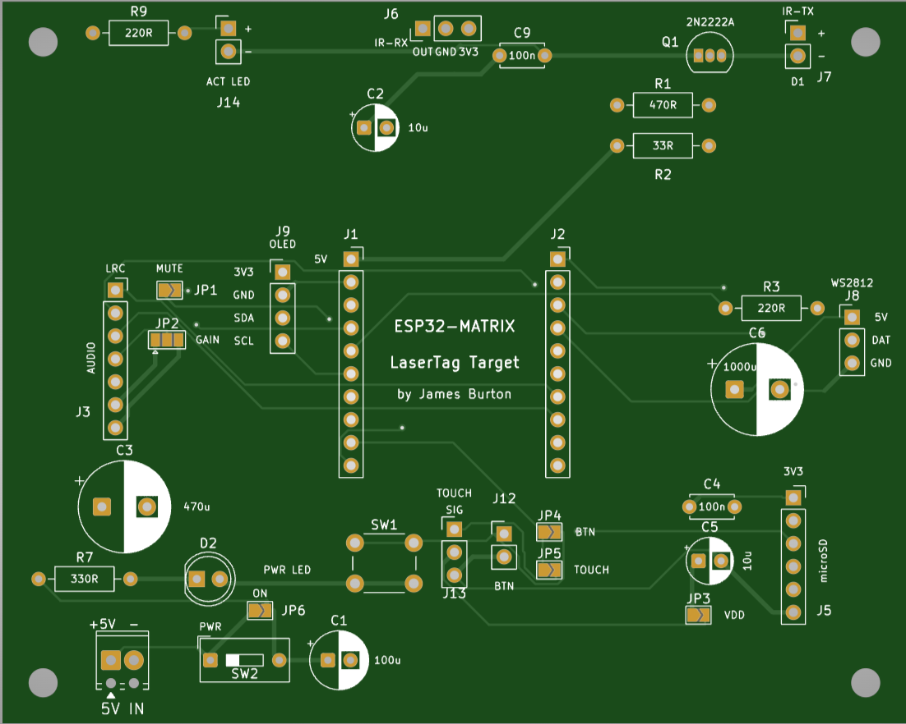

# Build Guide — LaserTag Carrier (ESP32-S3-Matrix), rev1

Assembly instructions for the **lasertag-carrier rev1** PCB (100×80 mm), a
through-hole carrier board for the Waveshare ESP32-S3-Matrix that hosts the
IR laser-tag receiver/transmitter, an optional MAX98357A audio amp, optional
microSD sound storage, an optional external WS2812 output, an OLED header,
and a GP2 role-selector (touch / button / audio-mute).

Reference material:
- Authoritative BOM: [`hardware/lasertag-carrier/bom.csv`](../hardware/lasertag-carrier/bom.csv) (32 BOM lines / 38 fitted parts)
- Full toolchain + fab journey: [`PCB_FROM_PLATFORMIO.md`](../PCB_FROM_PLATFORMIO.md)
- Per-block circuit spec/netlist: `.docs/pcb-blocks.md` (RECONCILED 2026-07-04 section is authoritative over the earlier tables in that file)

**bom.csv is authoritative for what's fitted.** Where sources disagreed, the
notes below say so explicitly and were resolved by reading pad nets directly
out of `hardware/lasertag-carrier/layouts/default/default.kicad_pcb` (the
source of truth for the actual board — never re-run `ato build`, it
regenerates the layout from scratch and will destroy the hand-placed/routed
board).

## Before you start

- **Square pad = pin 1**, on every connector on this board (confirmed against
  the KiCad footprint pads for J0, J6, D2, SW2 while writing this guide — the
  rule holds board-wide, not just anecdotally).
- **Mounting holes H1–H4** (M3, 4×) are plain mechanical holes — no
  components to fit, just standoffs/screws when you case the board.
- Work through the stages below in order: each stage is soldered
  low-profile-part-first (resistors → diodes/small caps → headers/sockets/
  jumpers → bulk caps/connectors) so nothing tall blocks access to a
  still-empty pad.
- Tin your iron, have isopropyl alcohol + a brush for flux cleanup, and a
  multimeter for the pre-power continuity/current checks in the bring-up
  section.

---

## Stage 1 (Core) — Power input, switch, power LED

Gets you a board that lights its power LED with nothing else fitted. Populate
in this order:

| Order | Ref | Part | Notes |
|---|---|---|---|
| 1 | R7 | 330 Ω axial resistor | Power-LED series resistor. Bend leads tight to the board, this sits low. |
| 2 | D2 | 5 mm power LED | **Polarity matters** — long lead/flat-side-of-rim = cathode. Silkscreen shows the flat side; match it. |
| 3 | JP6 | Solder-jumper pad, "always-on" | Leave **open** (default). See jumper table below — closing it bypasses SW2. |
| 4 | SW2 | Slide power switch | In series between the terminal block and the rest of the board. |
| 5 | J0 | 2-pin terminal block | **Power input.** Square/left pad = +5V, round/right pad = GND (confirmed: J0 pin 1 net is `VCC5_IN`, pin 2 is `GND`). |
| 6 | C1 | 100 µF/10 V electrolytic | Bulk decoupling at the 5 V entry. **Electrolytic polarity** — stripe = negative leg, matches the flat/marked silkscreen side. |

**Verified on the netlist:** SW2's two pads are `VCC5_IN` (from J0) and
`VCC5` (the board rail) — i.e. SW2 sits in series on the power path exactly
as expected. JP6's two pads are the *same* two nets (`VCC5_IN` and `VCC5`),
soldered in parallel with SW2 — closing JP6 shorts across the switch. See
the jumper table for what that means in practice.

## Stage 2 (Core) — ESP32-S3-Matrix module sockets

| Order | Ref | Part | Notes |
|---|---|---|---|
| 1 | J1 | 1×10 pin socket, left row | Module's **5 V pad → J1's square pin-1 pad.** |
| 2 | J2 | 1×10 pin socket, right row | 22.86 mm (9×0.1″) row spacing from J1 — the module sets this, don't guess a different pitch. |

**Solder-side alignment trick:** don't solder the sockets freehand. Push both
1×10 sockets onto the ESP32-S3-Matrix module's pins first (module bridges
both rows and holds the correct spacing/parallelism), rest the assembly on
the PCB pads, tack one corner pin on each socket, check the module sits flat
and square, then solder the rest. Remove the module afterwards — you're
soldering the sockets, not the module, and it should stay off the board
until the bring-up current check (below) has passed.

## Stage 3 (Core) — IR receiver

| Order | Ref | Part | Notes |
|---|---|---|---|
| 1 | C9 | 100 nF ceramic disc | VCC3V3 decoupling for the IR receiver, right at J6. |
| 2 | J6 | IR-RX header (1×3, or direct-solder receiver) | **Pin order OUT · GND · 3V3**, square pad = pin 1 (OUT). Confirmed in the netlist: J6 pin 1 = `ir_rx` (OUT), pin 2 = `GND`, pin 3 = `VCC3V3`. |

**Verify your specific receiver's pinout before soldering.** The board
targets HS0038(B) (best ambient-light rejection); VS1738 / VS1838B /
LF1638B are also confirmed 38 kHz and on-hand, but **clone batches vary
pinout** — reversed VCC/GND kills the part. Cross-check the part's datasheet
against OUT·GND·3V3 before committing solder. **VCC must be 3V3, not 5V** —
a 5V-powered receiver idles its OUT line near 5V, over the S3's 3.3V GPIO
absolute max.

## Stage 4 (Core) — IR transmitter driver

| Order | Ref | Part | Notes |
|---|---|---|---|
| 1 | R1 | 470 Ω axial resistor | GP37 → Q1 base current limiter. |
| 2 | R2 | 33 Ω axial resistor | 5V → IR-LED current limiter (≈105 mA; a 22 Ω substitute gives ≈150 mA if you want more range and have one on hand). |
| 3 | Q1 | 2N2222A, TO-92 | **Orient the flat face per the silkscreen outline** — TO-92 pinout (E/B/C) varies by manufacturer/equivalent (BC337-40, S8050 are drop-in equivalents but double-check their datasheet pin order too if substituting). |
| 4 | J7 | 2-pin header | IR LED cable connector. Pin 1 = anode (+), pin 2 = cathode (−), square pad = pin 1. |

The IR LED itself (silkscreen "D1") is **not populated on this board** — it
lives off-board on a short cable terminated in a plug that mates with J7
(see "Direct-wire vs plug/socket" below).

---

## Optional blocks

Everything below is independently DNP (do-not-populate) per `bom.csv`. Skip
any block you don't need; each is called out with what it needs and, where
relevant, what it depends on.

### Audio (MAX98357A)

Needs: J3 (1×7 socket), JP1 (mute jumper), JP2 (gain jumper), C3 (470 µF
bulk cap).

| Order | Ref | Part | Notes |
|---|---|---|---|
| 1 | JP1 | Solder jumper, 2-pad | **Mute strap.** Leave open (default). |
| 2 | JP2 | Solder jumper, 3-pad | **Gain strap.** Leave floating (default = 9 dB). |
| 3 | J3 | 1×7 pin socket | MAX98357A module plugs in. **LRC pin → J3's square end** (pin 1). Pin order LRC·BCLK·DIN·GAIN·SD·GND·VIN. |
| 4 | C3 | 470 µF/10 V electrolytic | VIN bulk cap right at J3 pin 7 — Class-D switching spikes need this close. Electrolytic polarity: stripe = negative. |

The speaker itself has **no carrier connector** on this rev — the MAX98357A
breakout module carries its own SPK+/SPK− solder pads; wire the speaker
straight to those pads on the module, not to the carrier.

### microSD

Needs: J5 (1×6 socket), C4 (100 nF ceramic), C5 (10 µF electrolytic), JP3
(VDD-select jumper).

**There is no point fitting microSD without also fitting audio** — on this
firmware, the card's only current role is holding sound clips
(`/sfx/*.wav`) played through the MAX98357A amp. Fit both or neither.

| Order | Ref | Part | Notes |
|---|---|---|---|
| 1 | C4 | 100 nF ceramic disc | SD_VDD decoupling at the socket. |
| 2 | JP3 | Solder jumper, 2-pad | **VDD select.** Bridge to the default leg (sources SD_VDD from onboard VCC3V3) — see note below. |
| 3 | J5 | 1×6 pin socket | microSD breakout module. **3V3 pin → J5's square end** (pin 1). Pin order 3V3·CS·MOSI·CLK·MISO·GND. |
| 4 | C5 | 10 µF/10 V electrolytic | Bulk reservoir for card init inrush. Electrolytic polarity: stripe = negative. |

**Verify on board:** the design docs describe an *optional* dedicated 3.3 V
LDO (U5) for the SD rail, with JP3 selecting between onboard VCC3V3 and the
LDO's output. **U5 and its input/output caps (C10/C11) are not in
`bom.csv` and do not appear on the render** — this board was fabricated
without the LDO option. JP3 should simply be left on its default bridge
(VCC3V3 → SD_VDD); there is no LDO output to select instead on this board.

### External WS2812 output

Needs: J8 (1×3 header), R3 (220 Ω series resistor), C6 (1000 µF bulk cap).

| Order | Ref | Part | Notes |
|---|---|---|---|
| 1 | R3 | 220 Ω axial resistor | Series on DATA, between GP6 and J8 pin 2. |
| 2 | J8 | 1×3 header | Pin 1 = 5V, pin 2 = DATA, pin 3 = GND. |
| 3 | C6 | 1000 µF/10 V electrolytic | Bulk reservoir for strip power-on inrush. Electrolytic polarity: stripe = negative. |

Short strips (<1 m) generally run fine on 3.3 V data straight from this
header. For long runs or strips needing V_IH > 3.3 V, use the separate
(off-board, not part of this BOM) 74AHCT125 level-shifter board between J8
and the strip.

### OLED / I2C header

Needs: J9 (1×4 header) only.

| Order | Ref | Part | Notes |
|---|---|---|---|
| 1 | J9 | 1×4 header | Pin 1 = 3V3, pin 2 = GND, pin 3 = SDA, pin 4 = SCL. I2C address for SSD1306 = 0x3C. |

R4/R5 (I2C pull-ups) are in the design spec but are **not in `bom.csv`** —
leave DNP; SSD1306 breakout modules almost always carry their own 4.7 kΩ
pull-ups.

### Activity-LED header

Needs: R9 (220 Ω resistor), J14 (1×2 header).

| Order | Ref | Part | Notes |
|---|---|---|---|
| 1 | R9 | 220 Ω axial resistor | Series limiter on GP7. |
| 2 | J14 | 2-pin header | External repeat of the activity indicator. |

The primary hit/activity indicator is the ESP32-S3-Matrix module's own
onboard LED on GP7 (already firmware-driven) — this header is only for an
external repeat LED if you want the indicator visible off-module.

### Touch / button (GP2 role selector hardware)

Needs: SW1 (6 mm tactile switch), J12 (external button header), J13 (touch
header), JP4, JP5. (JP1, covered under Audio above, is the third mutually
exclusive option for this same GP2 pin.)

| Order | Ref | Part | Notes |
|---|---|---|---|
| 1 | JP4 | Solder jumper, 2-pad | Selects GP2 → button (SW1/J12). |
| 2 | JP5 | Solder jumper, 2-pad | Selects GP2 → touch SIG (J13). |
| 3 | SW1 | 6 mm tactile switch | Onboard button, only active if JP4 is closed. |
| 4 | J12 | 2-pin header | External button, wired in parallel with SW1. |
| 5 | J13 | 1×3 header | Touch sensor header: SIG / VCC3V3 / GND. **Touch module VCC must be 3V3**, not 5V. |

Close **at most one** of JP1 / JP4 / JP5 — see the jumper table.

---

## Direct-wire vs plug/socket options

Three connectors on this board feed off-board LEDs/strips. Each can be
wired two ways:

| Connector | Off-board part | Direct-solder | Header + plug | Default recommendation |
|---|---|---|---|---|
| J7 (IR LED) | IR emitter, on a cable | Solder LED leads straight to a pigtail soldered into the pads | Crimp a 2-pin Dupont/JST plug onto the LED's leads, mate to J7's header | **Header + plug.** The LED lives off-board by design (needs aiming); swap-in-place beats desoldering if it fails or you want a different angle/wavelength part. |
| J14 (activity LED) | External repeat of the hit indicator | Solder a bare LED's legs straight into the pads | Header + 2-pin plug on a short pigtail | **Direct-solder** if the LED is being epoxied into a fixed spot on the case; **header+plug** if it needs to be removable/relocatable (e.g. a swappable front panel). Pick per your enclosure. |
| J8 (WS2812 out) | External LED strip | Solder the strip's wires straight into the pads | Header + JST/Dupont plug matching the strip's input pigtail | **Header + plug.** Strips get swapped, extended, or replaced far more often than any other part on this board — keep it serviceable. |

---

## Orientation gotchas

- **Square pad = pin 1, everywhere on this board.** Verified against the
  KiCad footprints for J0, J6, D2, and SW2 while writing this guide.
- **ESP32-S3-Matrix module:** the module's 5V pad goes into **J1's square
  pad** (J1 pin 1). Getting this backwards on a socketed module is
  survivable (it just won't boot) but check before powering up.
- **MAX98357A module:** its LRC pin goes into **J3's square end** (pin 1 of
  the 1×7 socket, header order LRC·BCLK·DIN·GAIN·SD·GND·VIN).
- **microSD breakout module:** its 3V3 pin goes into **J5's square end**
  (pin 1 of the 1×6 socket, order 3V3·CS·MOSI·CLK·MISO·GND).
- **IR receiver (J6):** pin order OUT·GND·3V3, square = pin 1 (OUT).
  **Verify each receiver substitute's pinout before soldering** — reversed
  VCC/GND kills the part, and clone batches of VS1738/VS1838B/LF1638B don't
  always agree with HS0038(B)'s pinout.
- **Electrolytic capacitors** (C1, C3, C5, C6): stripe marks the **negative**
  leg. C1/C3/C5/C6 are all in this build if their block is fitted — check
  each one before soldering, not just the first.
- **2N2222A (Q1):** orient the transistor's flat face to match the
  silkscreen outline. TO-92 pin order (E/B/C vs C/B/E) varies between
  2N2222A, BC337-40, and S8050 — if you substitute a different part number,
  re-check its datasheet pinout, don't assume it matches.
- **JP6 always-on bridge, verify on board:** confirmed by reading the pad
  nets directly (JP6's two pads carry the same nets as SW2's two pads,
  `VCC5_IN` and `VCC5`) that closing JP6 shorts across the power switch.
  This wasn't spelled out in `.docs/pcb-blocks.md` (that spec predates the
  switch/jumper addition) — the behaviour above is derived from the actual
  `.kicad_pcb`, not assumed.

---

## Jumper / strap settings

| Jumper | Default | Effect when closed / moved | Notes |
|---|---|---|---|
| **JP6** | Open | Bridges `VCC5_IN` to `VCC5`, shorting across SW2 — board is powered whenever J0 has power, **regardless of switch position** | Leave open so SW2 actually switches the board. Close only if you've removed/bypassed SW2 entirely. |
| **JP1** (audio mute) | Open | Wires GP2 to the MAX98357A SD pin for a firmware hard-mute of the amp | Mutually exclusive with JP4/JP5 (GP2 role selector) — see below |
| **JP2** (audio gain) | Float | GND leg = 15 dB, VIN leg = 3 dB (float = 9 dB) | Volume is controlled in software (`kVolume`); this is a build-time baseline gain choice only |
| **JP3** (microSD VDD select) | Bridged to onboard VCC3V3 | Would source SD_VDD from a dedicated LDO (U5) instead | **This board has no U5 fitted** (not in `bom.csv`/render) — leave JP3 on its default bridge |
| **JP4** (GP2 role: button) | Open | GP2 reads SW1 / J12 (external button), internal pull-up | Mutually exclusive with JP1/JP5 |
| **JP5** (GP2 role: touch) | Open | GP2 reads J13 SIG (touch sensor) | Recommended GP2 role if you use one at all. Mutually exclusive with JP1/JP4 |

**Close at most one of JP1 / JP4 / JP5.** GP2 is a single pin shared by
three mutually-exclusive optional roles (audio hard-mute, button, touch) —
closing more than one shorts those signals together. Default (all three
open) leaves GP2 an unconnected spare/test-point and the audio amp's SD pin
floating high (always enabled) via its own internal pull-up.

---

## Bring-up checklist

1. **Visual inspection.** Compare the populated board against
   [`board-render-rev1.png`](../hardware/lasertag-carrier/board-render-rev1.png)
   — check refdes placement, electrolytic cap polarity, Q1 orientation, and
   that every intended connector is actually fitted (nothing bridged by
   solder that shouldn't be).
2. **5V current check *before* seating any module.** Power J0 from a bench
   supply with current limiting (or just watch the meter) with SW2 on and
   nothing plugged into J1/J2/J3/J5. You should see essentially nothing but
   the power-LED's quiescent draw. A short here means a soldering fault —
   find it before any module is at risk.
3. **Seat the ESP32-S3-Matrix module** into J1/J2 (5V pad to J1's square
   pad), power up, confirm the power LED and the module's own status
   behaviour.
4. **Do not power via USB and the terminal block at the same time** — there
   is no backfeed isolation on this board. Pick one source.
5. **Smoke tests over serial** (USB-CDC, COM6 on the ESP32-S3-Matrix in this
   project's dev setup):
   - `fire <team> <damage>` — manual IR TX test; confirm the matrix and any
     listening receiver register the hit.
   - `sfx <idx>` — play a baked-in sound clip directly (audio block fitted).
   - `sdplay` — mount/list/play from the microSD card (microSD block
     fitted; requires audio too, see note above).
   - Confirm the WS2812 health bar responds to `fire`/damage and idles
     correctly.
6. Only after the smoke tests pass, close whichever GP2-role jumper
   (JP1/JP4/JP5) you intend to use — leave it open until then so you're not
   debugging jumper strap issues on top of first-power issues.
